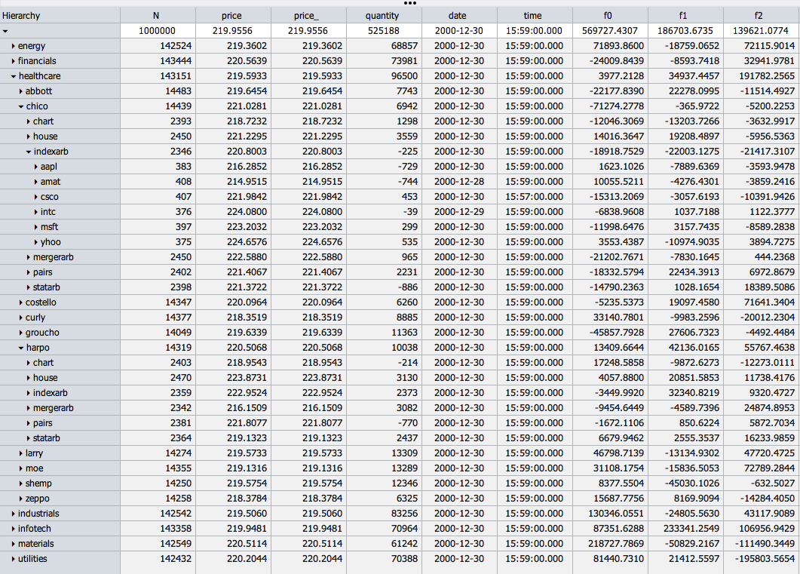

# hypertree
hypergrid treetable

[hypergrid control](http://openfin.github.io/fin-hypergrid/components/fin-hypergrid/demo.html)

----------------------------------------------------------------------------------------------

common to c and cs
------------------

	hypertree/t.q			treetable code
	hypertree/x.q			treetable globals
	hypertree/d.q			example data

c/: hypergrid treetable client
------------------------------

start treetable web client (default port 12345. \t = 0):

	cd hypertree/c
	q c.q

cs/: client-server hypergrid treetable
--------------------------------------

start client process (default port 12345, \t = 0 = no updates):

	cd hypertree/cs
	q c.q

start server process (default port 12346, \t = 500):

	cd hypertree/cs
	q s.q

client and server processes may be started in either order.

the two-process version decouples treetable recomputation and hypergrid interaction.

by default, the both client and server start on the same host.

----------------------------------------------------

The behavior of the treetable is controlled by a set of global variables in the root (x.q):

	T:`                                                      / underlying table
	Q::.ht.qtype T                                           / qtypes
	N::count Z                                               / treetable count
	F::cols[T]except G                                       / visible order
	G:()                                                     / group by 
	H::.ht.groupable T                                       / groupable
	I::cols[T]except G,F                                     / invisible (can be rolled up)
	A:()!()                                                  / rollup functions
	P:.ht.P                                                  / instruction state
	R:`start`end!0 100                                       / rows -> gui
	S:()!()                                                  / sorts (`a|`d|`A|`D)

Example settings (used in the demo):

	T:`t
	G:`sector`trader`strategy`symbol
	F:`N`wprice`wprice_`price`price_`quantity`date`time,f
	A[`price_]:((sum;`price_);(%;`price_;`N))                / map-reduce = (map;red)
	A[`price]:(avg;`price)                                   / bottom up version
	A[`wprice_]:enlist({sum[x*y]%sum x};`quantity;`wprice_)  / map, reduce is a no-op
	A[`wprice]:(wavg;`quantity;`wprice)                      / bottom up version
	
--------------------------------------------------

For a description of the bottom-up treetable algorithm used in this project, see http://archive.vector.org.uk/art10500340.

The top-down algorithm, a variety of map-reduce, is new.  A paper on the method will eventually appear in Vector.

